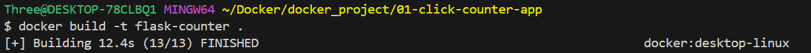
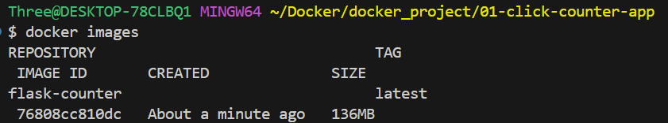
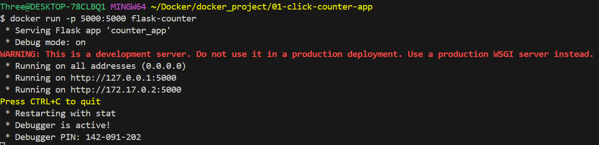
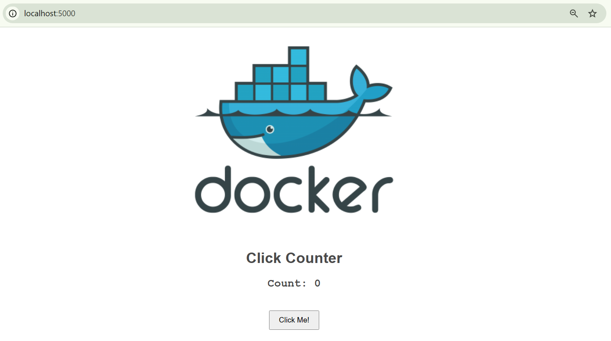
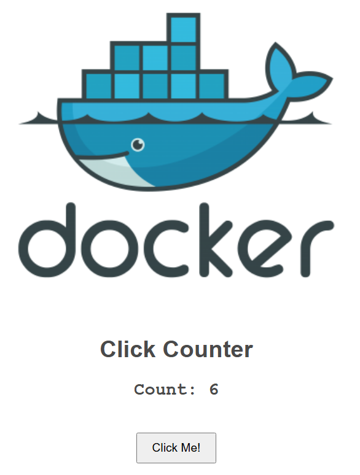
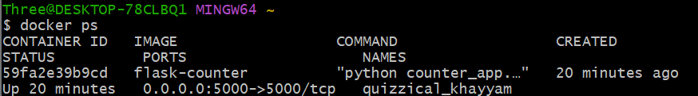
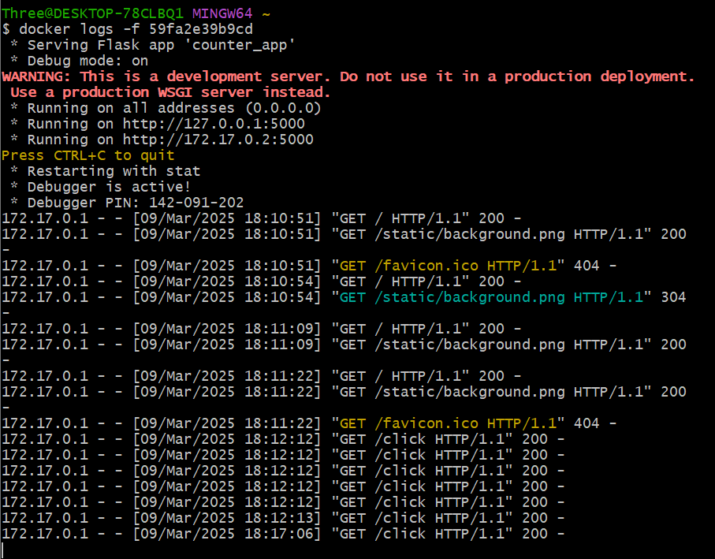
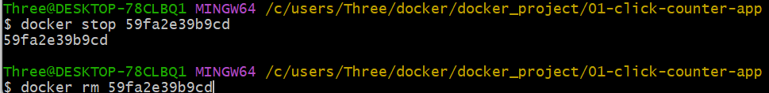
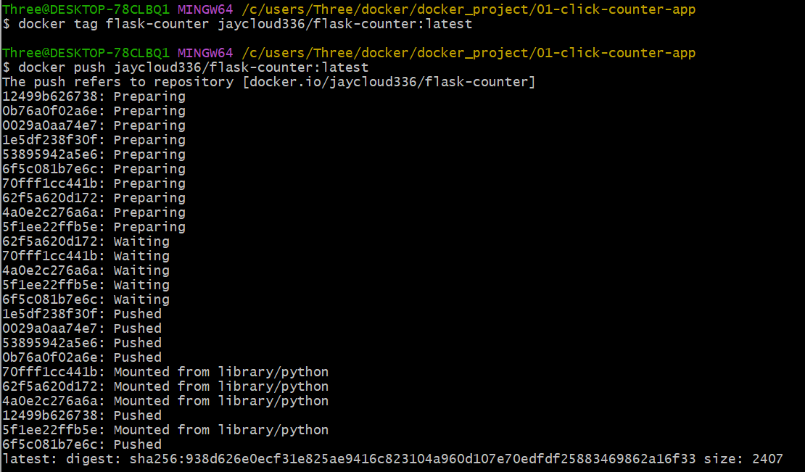
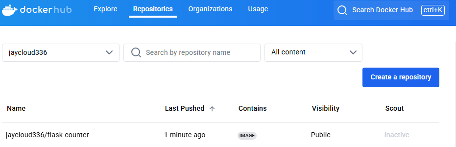

# Flask Click Counter App

### A simple Containerized Flask web app that tracks a web-based click counter. 

**Prerequisites**
- Docker Desktop Installed & Running
- DockerHub Account

**Getting Started**

**1. Clone the Repository**

`git clone https://github.com/jaycloud336/01-click-counter-app.git`

`cd flask-click-counter`

**2. Build the Docker Image**

`docker build -t flask-counter .`



`docker images`



**3. Run the Container**

`docker run -p 5000:5000 flask-counter`



**4. Access the Application**

***Open your browser and go to:***

http://localhost:5000



***Click the button to increment the counter!***



***Open a seperate terminal to view logs in real time (if main terminal is in detached mode)***

`docker logs -f <container id>`





## **Stopping & Removing the Container**
**Find the container ID**

`docker ps`

**Stop and remove the container**

`docker stop <CONTAINER_ID>`

`docker rm <CONTAINER_ID>`



**Push your image to Docker Hub (Optional)**

### Log in to Docker Hub

`docker login`

### Tag the image

`docker tag flask-counter <your-dockerhub-username>/flask-counter:latest`

### Push the image

`docker push <your-dockerhub-username>/flask-counter:latest`



Now your app is available in your own repository!



**Note:**
Click counter data is not persistent as there is no storage mechanism. This app is strictly for demonstration purposes.

## Enjoy the Flask Click Counter App! 🚀
```

